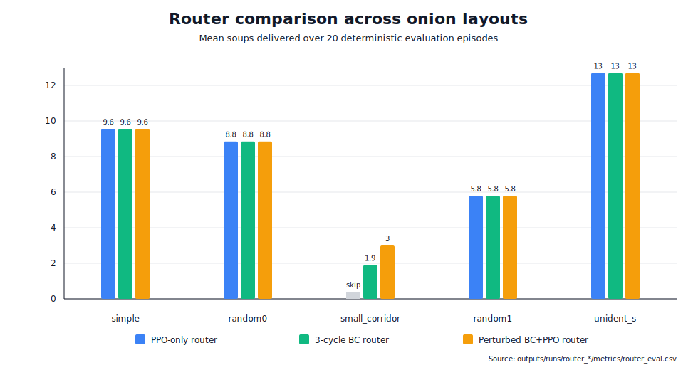
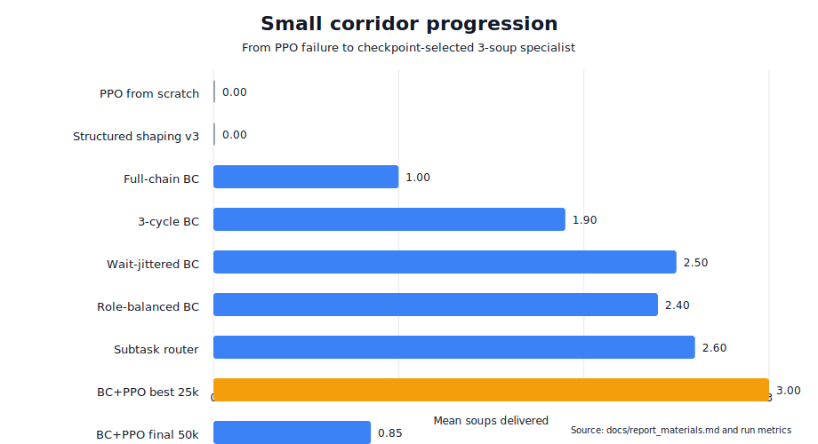
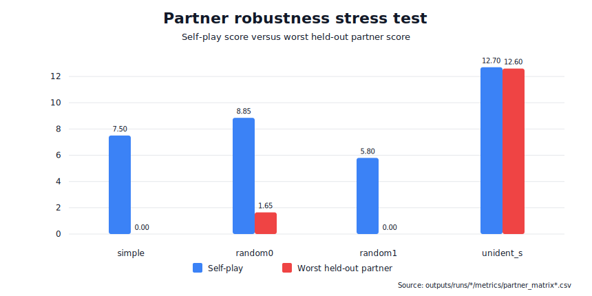

# 胡闹厨房 Overcooked 多智能体强化学习项目报告草稿

更新时间：2026-06-28

项目路径：`/Volumes/share/pku/26_spring/多智能体/finallab2`

本草稿基于 `docs/experiment_log.md` 和 `docs/report_materials.md` 整理。它不是完整排版版报告，而是可直接扩写为课程报告的正文骨架。

## 图表与演示索引

报告图：

| 编号 | 文件 | 用途 |
| --- | --- | --- |
| Figure 1 | [router_comparison.svg](assets/router_comparison.svg) | 对比 PPO-only router、3-cycle BC router 和 perturbed BC+PPO router。 |
| Figure 2 | [small_corridor_progression.svg](assets/small_corridor_progression.svg) | 展示 `small_corridor` 从 PPO 失败到 3-soup specialist 的过程。 |
| Figure 3 | [partner_robustness.svg](assets/partner_robustness.svg) | 展示 self-play 成功和 held-out partner 崩溃之间的差距。 |

推荐 GIF：

| Demo | Link | 用途 |
| --- | --- | --- |
| Default PPO baseline | [demo.gif](../outputs/runs/baseline_simple/demo/demo.gif) | 展示 `simple` baseline 成功。 |
| Sparse reward failure | [demo.gif](../outputs/runs/no_shaping_simple/demo/demo.gif) | 展示 sparse-only PPO 失败。 |
| Naive multi-layout failure | [simple_demo.gif](../outputs/runs/multi_layout_curriculum/demo/simple_demo.gif) | 展示朴素混训问题。 |
| `random0` specialist | [random0_long_demo.gif](../outputs/runs/baseline_random0_long/demo/random0_long_demo.gif) | 展示 hard-layout specialist。 |
| `random1` specialist | [random1_demo.gif](../outputs/runs/baseline_random1/demo/random1_demo.gif) | 展示另一张 hard layout。 |
| `unident_s` specialist | [unident_s_demo.gif](../outputs/runs/baseline_unident_s/demo/unident_s_demo.gif) | 展示最强 specialist。 |
| Best `small_corridor` specialist | [small_corridor_full_chain_3cycle_jitter3_bc_ppo_best_demo.gif](../outputs/runs/small_corridor_full_chain_3cycle_jitter3_bc_ppo_finetune/demo/small_corridor_full_chain_3cycle_jitter3_bc_ppo_best_demo.gif) | 展示最终 `small_corridor` 成功。 |

## 摘要

本项目研究两个智能体在 Overcooked 环境中的协作学习问题。我们以 Stable-Baselines3 PPO 为基础算法，通过 PantheonRL 的 simultaneous-agent wrapper 训练两个策略，并以每局交付汤数作为主要评价指标。实验显示，默认 reward shaping 可以让 PPO 在简单地图 `simple` 上学到有效协作策略，但纯 sparse reward、zero-shot 跨地图迁移和朴素多地图混训均表现不佳。

为提升多地图覆盖，我们进一步训练单地图 specialist，并用 layout router 按地图选择对应专家。该方法在 `simple`、`random0`、`random1` 和 `unident_s` 上取得稳定非零结果。最困难的 `small_corridor` 地图中，PPO 从零训练和多种 shaping 都无法完成上菜。我们通过 scripted full-chain behavior cloning、multi-cycle demonstrations、wait-perturbed demonstrations 和 checkpoint-selected PPO fine-tuning，将 `small_corridor` 提升到 3.00 soups。最终最强 router 在五个 onion layouts 上达到平均 7.98 soups，最低 3.00 soups。

项目结论是：在当前预算和环境栈下，最有效的路线不是单一 PPO 策略的跨地图泛化，而是 specialist training + policy selection router；同时，partner robustness 和 checkpoint selection 是必须显式评估的关键问题。

## 1. 问题设置

Overcooked 是一个合作式多智能体任务。两个智能体需要分工完成拿洋葱、放锅、等待烹饪、拿盘、取汤、上菜等子任务。每成功交付一份汤得到 sparse reward 20，因此本报告将 `soups delivered = sparse reward / 20` 作为主指标。

本项目主要关注以下问题：

1. PPO baseline 能否在简单地图上学会合作。
2. Reward shaping 对学习是否必要。
3. 单地图训练得到的策略能否 zero-shot 泛化到其他地图。
4. 多地图混训能否解决泛化问题。
5. 单地图 specialist 与 layout router 能否形成更强的实际方案。
6. `small_corridor` 这类困难地图能否通过 imitation / curriculum 方式被解决。
7. 自博弈成功是否意味着对不同 partner 鲁棒。

## 2. 方法

### 2.1 PPO Baseline

基础算法为 PPO。每个 layout 中训练 ego 和 partner 两个策略，使用 deterministic evaluation 评估 20 个 episodes。默认 horizon 为 400 steps。

主要配置和脚本：

- `configs/baseline_simple.json`
- `scripts/train.sh`
- `scripts/evaluate.sh`
- `scripts/record_demo.sh`

### 2.2 Reward Shaping 消融

我们比较三种设置：

| Run | 设置 | 目的 |
| --- | --- | --- |
| `no_shaping_simple` | 关闭 shaping | 检验 sparse-only 难度 |
| `baseline_simple` | 默认 shaping | 建立可靠 baseline |
| `distance_shaping_simple` | 默认 shaping + distance reward | 检验额外距离奖励是否有帮助 |

### 2.3 Specialist 与 Router

Zero-shot 和朴素多地图训练失败后，我们转向 specialist 路线：每个困难地图训练独立专家，再由 router 根据 layout name 选择对应 run。

Router 评估脚本：

- `src/overcooked_project/evaluate_router.py`
- `scripts/evaluate_router.sh`
- `configs/router_simple_random0.json`

### 2.4 Behavior Cloning 与 Small Corridor Curriculum

`small_corridor` 是最难的 onion layout。PPO 从零训练、多种结构化 shaping、delivery warm-start PPO 均无法从标准开局完成上菜。为解决这个问题，我们逐步加入监督轨迹：

1. `delivery` demos：只教最后送汤段。
2. `full_chain` demos：从标准开局完成一份汤。
3. `3-cycle full_chain` demos：重复完成三份汤。
4. `wait-jittered 3-cycle demos`：在安全同步点加入随机等待扰动。
5. 从 perturbed BC 初始化 PPO，并选择 25k best checkpoint。

相关脚本：

- `scripts/collect_delivery_demos.sh`
- `scripts/train_delivery_bc.sh`
- `scripts/train_curriculum.sh`

## 3. 实验结果

### 3.1 PPO Baseline 与 Reward Shaping

| Run | Layout | Mean soups | Mean sparse reward | 结论 |
| --- | --- | ---: | ---: | --- |
| `no_shaping_simple` | `simple` | 0.00 | 0.0 | Sparse-only 在当前预算下失败。 |
| `baseline_simple` | `simple` | 7.50 | 150.0 | 默认 shaping 能学到可用协作。 |
| `distance_shaping_simple` | `simple` | 7.50 | 150.0 | 该 distance shaping 没超过默认 shaping。 |

结论：reward shaping 对 PPO 学习是必要的，但简单叠加距离奖励并不一定提升最终 sparse performance。

### 3.2 Zero-Shot 与 Multi-Layout 失败

`baseline_simple` 在 `simple` 上能达到 7.50 soups，但在 harder layouts 上几乎没有 sparse reward：

| Layout | Mean soups |
| --- | ---: |
| `simple` | 7.50 |
| `small_corridor` | 0.00 |
| `random0` | 0.00 |
| `random1` | 0.00 |
| `unident_s` | 0.00 sparse |

朴素多地图 curriculum 也没有解决问题，甚至会损伤 `simple` 上的能力。这说明当前任务的跨地图泛化不能依赖简单的训练分布混合。

### 3.3 Specialist 与 Router 结果

单地图 specialist 可以解决多个困难地图：

| Specialist | Layout | Mean soups | Mean sparse reward |
| --- | --- | ---: | ---: |
| `curriculum_simple_random0` | `simple` | 9.55 | 191.0 |
| `baseline_random0_long_seed52` | `random0` | 8.85 | 177.0 |
| `baseline_random1` | `random1` | 5.80 | 116.0 |
| `baseline_unident_s` | `unident_s` | 12.70 | 254.0 |

三组 router 对比如下：

| Router | `simple` | `random0` | `small_corridor` | `random1` | `unident_s` | Average | Minimum |
| --- | ---: | ---: | ---: | ---: | ---: | ---: | ---: |
| PPO-only onion router | 9.55 | 8.85 | skipped | 5.80 | 12.70 | 9.23 | 5.80 |
| With 3-cycle BC `small_corridor` | 9.55 | 8.85 | 1.90 | 5.80 | 12.70 | 7.76 | 1.90 |
| With perturbed BC+PPO `small_corridor` | 9.55 | 8.85 | 3.00 | 5.80 | 12.70 | 7.98 | 3.00 |

当前最强结果是 checkpoint-selected perturbed BC+PPO `small_corridor` specialist 加入后的五地图 router，平均 7.98 soups，最低 3.00 soups。

### 3.4 Small Corridor Case Study

`small_corridor` 是项目中最有代表性的失败到成功案例：

| Run | Mean soups | Mean sparse reward | 解释 |
| --- | ---: | ---: | --- |
| `baseline_small_corridor` | 0.00 | 0.0 | PPO 从零失败。 |
| `small_corridor_structured_shaping_v3` | 0.00 | 0.0 | 能到 soup pickup，但不能上菜。 |
| `small_corridor_delivery_bc_from_v3` standard start | 0.00 | 0.0 | Delivery-only BC 太窄。 |
| `small_corridor_full_chain_bc_from_v3` | 1.00 | 20.0 | 一份汤 full-chain BC 成功。 |
| `small_corridor_full_chain_3cycle_bc_from_v3` | 1.90 | 38.0 | 多轮 BC 有提升但不稳定。 |
| `small_corridor_full_chain_3cycle_jitter3_bc_from_v3` | 2.50 | 50.0 | 等待扰动提升鲁棒性。 |
| `small_corridor_full_chain_3cycle_jitter3_bc_ppo_finetune` best at 25k | 3.00 | 60.0 | 20/20 局达到 3 soups。 |
| `small_corridor_full_chain_3cycle_jitter3_bc_ppo_finetune` final 50k | 0.85 | 17.0 | 过训练后崩溃。 |

这说明 `small_corridor` 的问题不只是 reward coefficient 不合适，而是长时序探索和多子任务衔接困难。Scripted demonstrations 提供了可学习的动作链，wait jitter 则让 BC 不再只记住精确时钟。PPO fine-tuning 在 25k checkpoint 进一步稳定策略，但 50k final 崩溃，说明 checkpoint selection 是必要的。

### 3.5 Partner Robustness

自博弈成功不代表 partner 泛化成功：

| Layout / ego | Self-play soups | Held-out partner soups | 解释 |
| --- | ---: | ---: | --- |
| `simple` baseline ego | 7.50 | 5.60 with seed11, 0.00 with seed12 | 简单地图也有 partner overfitting。 |
| `random0` long specialists | 6.30 to 8.85 | 1.65 to 7.70 | 跨 partner 不对称。 |
| `random1` specialists | 5.20 to 5.80 | 0.00 to 0.25 | 自博弈成功但跨 partner 崩溃。 |
| `partner_diversity_random1` | 2.25 to 4.55 with training partners | 0.45 with held-out seed72 | Seen partners 上更稳，但没有解决真正 held-out 泛化。 |
| `unident_s` specialists | 12.60 to 12.70 | 12.60 to 12.65 | 两个 seed 间较鲁棒。 |

因此报告中不能只展示 self-play 分数。每个声称鲁棒的 specialist 都应有 cross-play 或 held-out partner 证据。

## 4. Demo 与 Artifact

推荐展示 GIF：

| Demo | Path | 用途 |
| --- | --- | --- |
| Default PPO baseline | `outputs/runs/baseline_simple/demo/demo.gif` | 展示 `simple` baseline 成功。 |
| Sparse reward failure | `outputs/runs/no_shaping_simple/demo/demo.gif` | 展示 sparse-only 失败。 |
| Naive multi-layout failure | `outputs/runs/multi_layout_curriculum/demo/simple_demo.gif` | 展示朴素混训问题。 |
| `random0` specialist | `outputs/runs/baseline_random0_long/demo/random0_long_demo.gif` | 展示 hard-layout specialist。 |
| `random1` specialist | `outputs/runs/baseline_random1/demo/random1_demo.gif` | 展示另一张 hard layout。 |
| `unident_s` specialist | `outputs/runs/baseline_unident_s/demo/unident_s_demo.gif` | 展示最强 specialist。 |
| Best `small_corridor` specialist | `outputs/runs/small_corridor_full_chain_3cycle_jitter3_bc_ppo_finetune/demo/small_corridor_full_chain_3cycle_jitter3_bc_ppo_best_demo.gif` | 展示最终 small corridor 成功。 |

核心数据路径：

- 完整实验日志：`docs/experiment_log.md`
- 报告材料：`docs/report_materials.md`
- 最强 router：`outputs/runs/router_onion_layouts_with_small_corridor_jitter3_bc_ppo/metrics/router_eval.csv`
- `small_corridor` best/final checkpoint：`outputs/runs/small_corridor_full_chain_3cycle_jitter3_bc_ppo_finetune/metrics/train_summary.json`
- Partner matrix：`outputs/runs/*/metrics/partner_matrix*.csv`

## 5. 局限性

1. 当前最强方案是 specialist router，不是单一神经策略的跨地图泛化。
2. `small_corridor` 的成功依赖 scripted demonstrations 和 checkpoint selection，不能表述为 PPO 从零探索成功。
3. `random1` 在 held-out partner 下明显崩溃；两 partner 的 partner-aware training 只改善 seen partners，仍不足以解决 held-out seed72。
4. Tomato layouts 当前因 `KeyError: 'tomato'` 没有纳入主结果，应作为环境栈问题单独说明。
5. PPO fine-tuning 可能非单调，最终 checkpoint 不一定代表最佳策略。

## 6. 结论

本项目展示了一个从基础 PPO baseline 到 specialist router 的完整 MARL 实验链条。默认 shaping 的 PPO 能在 `simple` 上学到合作，但 sparse-only、zero-shot 和朴素多地图训练都失败。通过训练单地图 specialist 并使用 layout router，我们在多个困难 onion layouts 上获得了稳定表现。对于最困难的 `small_corridor`，我们通过 full-chain BC、多轮 demonstrations、wait perturbation 和 checkpoint-selected PPO fine-tuning，最终达到 3.00 soups。

因此，本项目的核心结论是：在当前 Overcooked 设置下，跨地图能力更适合通过 specialist composition 和 policy selection 来实现；如果要进一步追求统一策略或更强泛化，需要引入 layout-conditioned policy、distillation 或更大 population 的 partner-aware training。

## 7. 后续工作

1. 将本草稿扩写为正式报告，并加入 GIF 截图或链接。
2. 扩大 `random1` partner-aware training 的 partner population，检验是否能真正修复 held-out partner 崩溃。
3. 尝试 role-balanced `small_corridor` demos，减少对固定角色分工的依赖。
4. 尝试 distillation，把 router specialists 蒸馏成统一策略。
5. 单独修复 tomato layout 的 featurizer 问题。
